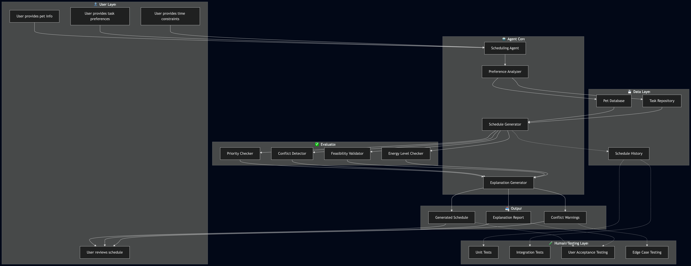
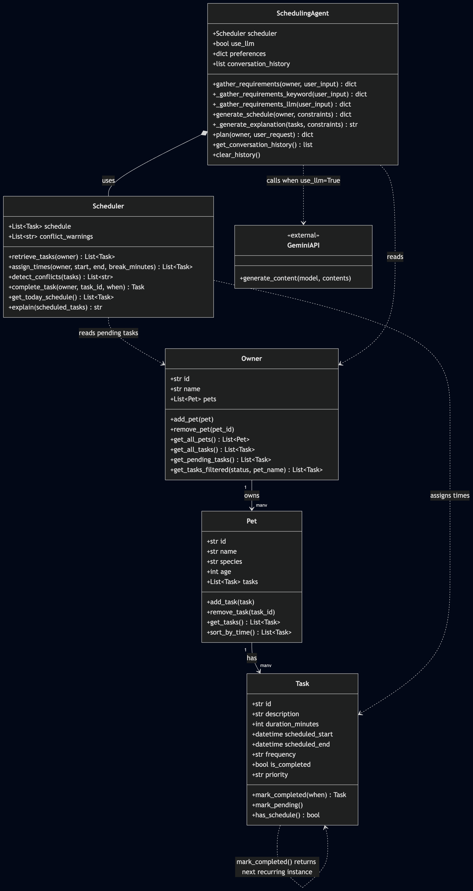

# PawPal+ — AI-Powered Pet Care Scheduler

## Original Project

The original **PawPal+**  was a rule-based pet care planning app built with Python and Streamlit. It allowed pet owners to add tasks with durations and priorities, then generate a daily schedule using a greedy time-window algorithm. The original system could sort and filter tasks, detect scheduling conflicts, and produce a human-readable explanation of the plan — but all scheduling logic was hardcoded keyword rules with no language understanding.

---

## Title and Summary

PawPal+ is a Streamlit app that helps pet owners plan their daily care tasks using natural language. It matters because managing pet care across multiple tasks, priorities, and time constraints is genuinely tedious — and a scheduling assistant that understands plain English requests removes that friction. The system supports three scheduling modes: a rule-based scheduler, a keyword-parsing agent, and a Gemini-powered LLM agent that understands synonyms and intent.

---

## Architecture Overview

The system is built in three layers. The **data model** (`Task`, `Pet`, `Owner`) represents the domain and enforces constraints like duplicate IDs and task recurrence. The **Scheduler** takes pending tasks from an Owner and greedily assigns them to a time window, sorted by priority, with optional break gaps and conflict detection. The **SchedulingAgent** wraps the Scheduler with an agentic loop — it parses natural language input into structured constraints (via keyword rules or Gemini), calls the Scheduler to produce a plan, then generates a human-readable explanation with a coverage rate metric.

**System Diagram (Agentic Workflow):**



**Class Diagram:**



---

## Setup Instructions

```bash
# 1. Clone the repo and install dependencies
pip install -r requirements.txt

# 2. Add your Gemini API key (get one free at aistudio.google.com)
cp .env.example .env
# Edit .env and set: GEMINI_API_KEY=your_key_here

# 3. Run the app
streamlit run app.py
```

To run tests (no API key needed — Gemini is mocked):
```bash
python -m pytest tests/test_pawpal.py -v
```

---

## Sample Interactions

**1. Keyword Agent — morning schedule with a break**
> Input: `"Schedule my morning walk and feeding with a 15 minute break"`
>
> Output: Tasks scheduled 07:00–12:00 with a 15-minute gap between them. Explanation lists preferred time, task types, and break duration. Coverage: 100%.

**2. Keyword Agent — low energy afternoon**
> Input: `"My dog is tired and low energy today, just schedule feeding and grooming in the afternoon"`
>
> Output: Tasks scheduled 12:00–17:00. Explanation notes `Pet energy level: low` and `Preferred time: afternoon`.

**3. LLM Agent — synonym understanding**
> Input: `"After lunch my pup needs a scrub, he's been zooming all day"`
>
> Output: Gemini maps `"after lunch"` → afternoon, `"scrub"` → bath, `"zooming"` → high energy. Keyword parser would miss all three.

---

## Design Decisions

The agent uses a **constraints dictionary** as the interface between parsing and scheduling, so the keyword and LLM parsers are fully interchangeable — the Scheduler doesn't know or care which one ran. The LLM is used only for parsing (one structured JSON call), not for generating the schedule itself, which keeps the scheduling logic deterministic and testable. The trade-off is that `task_types` and `pet_energy_levels` are captured in constraints and surfaced in the explanation, but don't yet reorder tasks — that would require a more complex planner.

---

## Testing Summary

The test suite has 25 tests covering task creation, priority ordering, break gaps, recurring tasks, conflict detection, coverage rate, and all three LLM test scenarios — all 25 pass. Gemini API calls are fully mocked using `unittest.mock.patch`, so tests are fast, deterministic, and require no API key. The hardest bug to track down was the UI time pickers silently overriding the NL-parsed time window — the schedule would say "afternoon" in the explanation but schedule tasks at 08:00. The fix was to only apply the UI pickers when the prompt contained no time preference.

**Reliability Measures:**
- **Automated tests:** 25/25 passing; LLM synonym understanding, priority ordering, break gaps, and feasibility are all verified with pinned datetimes and mocked API responses.
- **Coverage rate metric:** Every schedule returns a `coverage_rate` (0.0–1.0) showing what fraction of pending tasks fit in the time window — displayed live in the UI so the user knows immediately if tasks were dropped.
- **Graceful error handling:** The LLM path wraps the Gemini call in `try/except`; any API failure (quota exceeded, bad key, malformed JSON) silently falls back to keyword parsing so the app never crashes.
- **Input guardrails:** `get_tasks_filtered` raises `ValueError` on invalid status values; `add_task` and `add_pet` reject duplicate IDs — preventing silent data corruption at the boundary.

---

## Reflection

This project taught me that the hardest part of building an AI system is not the model call — it's designing the interface between natural language understanding and deterministic logic. Wrapping the LLM in a structured JSON contract made it easy to mock in tests and swap out the parser without touching the scheduler. I also learned that graceful fallbacks matter: adding a `try/except` that falls back to keyword parsing meant the app stayed functional even when the Gemini API quota was exhausted, which happened frequently during development.

---

## Responsible AI

**Limitations and biases:** The keyword parser only recognizes a fixed vocabulary — it misses synonyms, non-English input, and any phrasing outside its hardcoded lists. The LLM parser inherits Gemini's training biases and may map culturally specific expressions incorrectly. Neither parser validates the *quality* of a schedule — a plan that fits mathematically but is exhausting for the pet is still marked 100% coverage.
**Mitigation strategies:** The fallback to keyword parsing ensures the app remains functional even if the LLM fails or produces unexpected output. The UI displays the coverage rate prominently, so users can see at a glance if their request was fully understood or if some tasks were dropped. Future improvements could include user feedback loops to correct misinterpretations and a more sophisticated planner that considers pet well-being, not just task fit.
